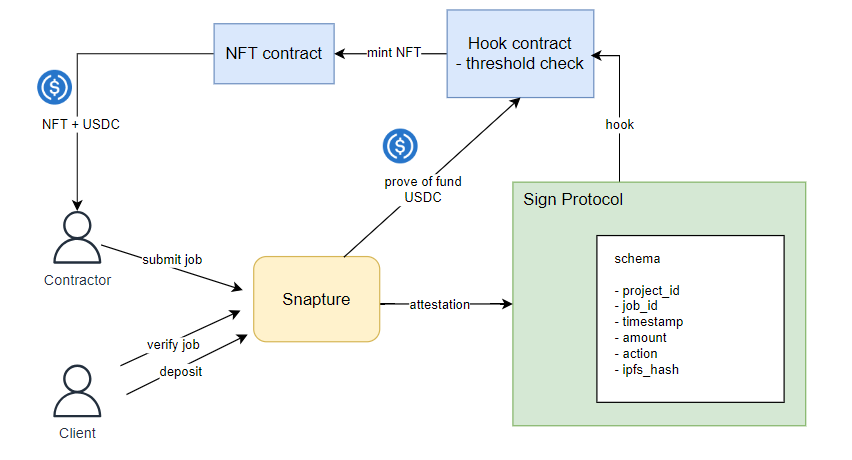

# Multisig-Factory

## Project Description

- This project is built on top of Sign Protocol

  - the attestation schema

    - project_id
    - job_id
    - timestamp
    - amount
    - action
    - ipfd_hash

  - hook feature
    - to trigger NFT minting and fund distribution

## Getting Started

### Run Locally

- Get necessary API keys and configure `.env` at local.
- Go to [web](./web/) folder and run NextJS locally.

```bash
cd ./web
npm run dev
```

## User Flow



## Reference

Deployed smart contracts:

- Sepolia
  - Nft: https://sepolia.etherscan.io/address/0x5230B61438C3f1b309E2b924dBf6FAFa33bbB73e#code
  - Hook: https://sepolia.etherscan.io/address/0xCE85cFf74ED85B2B459bb416884774DFFC6D02fF#code
- Gnosis Chiado
  - https://gnosis-chiado.blockscout.com/address/0xa7175491676fa1c205fbc2215e4eeabee2927f2b?tab=contract
  - https://gnosis-chiado.blockscout.com/address/0x3E57Fb5f9A21E518b667a55235da34B723DD83d9?tab=contract
